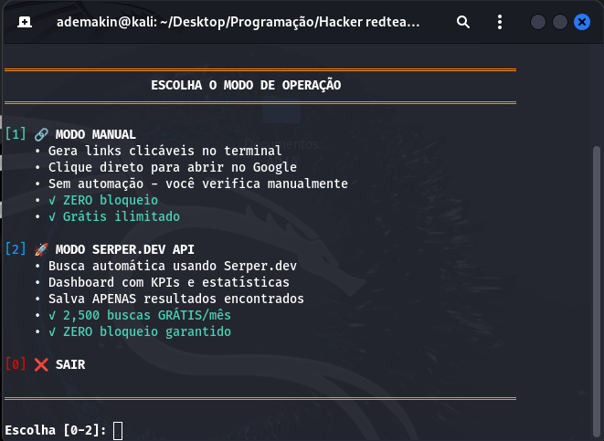

<div align="center">

# 🔍 Google Dork Scanner v3.0

### Ferramenta de Auditoria de Segurança com Google Dorks

[](https://python.org)
[](LICENSE)
[]()
[]()

<br>

**Uma ferramenta poderosa e moderna para realizar buscas de reconhecimento usando Google Dorks.**

[Instalação](#-instalação) •
[Como Usar](#-como-usar) •
[Funcionalidades](#-funcionalidades) •
[Troubleshooting](#-troubleshooting) •
[FAQ](#-faq)

<br>



</div>

---

## ⚠️ Aviso Legal

> **IMPORTANTE:** Esta ferramenta deve ser usada **APENAS** para fins educacionais e em sistemas que você possui ou tem autorização explícita para testar. O uso indevido desta ferramenta pode violar leis locais e internacionais. O autor não se responsabiliza pelo mau uso.

---

## 📋 Índice

- [Sobre o Projeto](#-sobre-o-projeto)
- [Funcionalidades](#-funcionalidades)
- [Requisitos](#-requisitos)
- [Instalação](#-instalação)
- [Como Usar](#-como-usar)
- [Modos de Operação](#-modos-de-operação)
- [Configuração da API](#-configuração-da-api)
- [Categorias de Dorks](#-categorias-de-dorks)
- [Troubleshooting](#-troubleshooting)
- [FAQ](#-faq)
- [Contribuição](#-contribuição)
- [Licença](#-licença)

---

## 🎯 Sobre o Projeto

O **Google Dork Scanner v3.0** é uma ferramenta de código aberto para profissionais de segurança, pentesters e entusiastas que desejam realizar reconhecimento passivo em domínios alvo utilizando Google Dorks.

### Por que usar esta ferramenta?

- ✅ **170 dorks** classificados por severidade (crítico → baixo) em 20 categorias
- ✅ **Interface moderna** com [rich](https://github.com/Textualize/rich) (tabelas, barra de progresso, cores) — e fallback em texto puro
- ✅ **Modo linha de comando** (`argparse`) para automação e scripts
- ✅ **Busca paralela** via API Serper.dev, com detecção de cota esgotada
- ✅ **Relatórios em HTML, JSON, CSV e TXT** — só com os resultados encontrados
- ✅ **API Key** via argumento, variável de ambiente ou config salva (permissão `600`)
- ✅ **Testes automatizados** (`pytest`) e lint (`ruff`)

---

## ✨ Funcionalidades

| Funcionalidade | Modo Manual | Modo API |
|----------------|:-----------:|:--------:|
| Links clicáveis no terminal | ✅ | ❌ |
| Busca automática | ❌ | ✅ |
| Dashboard com KPIs | ❌ | ✅ |
| Salvar relatório | ❌ | ✅ |
| Zero bloqueio | ✅ | ✅ |
| Custo | Grátis ∞ | 2,500/mês grátis |
| Velocidade | Manual | Automático |

---

## 📦 Requisitos

### Sistema Operacional
- Linux (Ubuntu, Debian, Kali, etc.)
- Windows 10/11 (com Python)
- macOS 10.15+

### Software
- **Python 3.8** ou superior
- **pip** (gerenciador de pacotes Python)
- **Terminal** com suporte a cores ANSI

### Verificar se Python está instalado:

```bash
python3 --version
```

**Saída esperada:**
```
Python 3.8.10
```

---

## 🚀 Instalação

### Método 1: Clonando o Repositório (Recomendado)

```bash
# 1. Clone o repositório
git clone https://github.com/ademakin3051/google-dork-scanner.git

# 2. Entre na pasta do projeto
cd google-dork-scanner

# 3. Dê permissão de execução ao script
chmod +x dork_scanner_v3.py

# 4. Execute
python3 dork_scanner_v3.py
```

### Método 2: Download Direto

```bash
# 1. Baixe os arquivos
wget https://raw.githubusercontent.com/ademakin3051/google-dork-scanner/main/dork_scanner_v3.py
wget https://raw.githubusercontent.com/ademakin3051/google-dork-scanner/main/dorks_database.json

# 2. Dê permissão de execução
chmod +x dork_scanner_v3.py

# 3. Execute
python3 dork_scanner_v3.py
```

### Método 3: Download Manual

1. Clique em **"Code"** → **"Download ZIP"**
2. Extraia o arquivo ZIP
3. Abra o terminal na pasta extraída
4. Execute:

```bash
chmod +x dork_scanner_v3.py
python3 dork_scanner_v3.py
```

---

## 🎮 Como Usar

### Instalar a dependência opcional (interface bonita)

```bash
pip install -r requirements.txt   # instala o "rich"
```

> Sem o `rich`, o script continua funcionando em modo texto simples.

### Modo Interativo (menu)

```bash
python3 dork_scanner_v3.py
```

### Modo Linha de Comando (automação)

```bash
# Gera links + relatório HTML clicável (modo manual)
python3 dork_scanner_v3.py -d exemplo.com

# Busca automática via API e salva relatório JSON
export SERPER_API_KEY="sua_chave"
python3 dork_scanner_v3.py -d exemplo.com --api -f json -o relatorio.json

# Busca paralela com 10 workers e resultados em CSV
python3 dork_scanner_v3.py -d exemplo.com --api -w 10 -f csv
```

| Opção | Descrição |
|-------|-----------|
| `-d, --domain` | Domínio alvo |
| `--api` | Usa a API Serper.dev (busca automática) |
| `--api-key` | Chave da API (ou use a env `SERPER_API_KEY`) |
| `-f, --format` | Formato do relatório: `html`, `json`, `csv`, `txt` |
| `-o, --output` | Caminho do arquivo de saída |
| `-w, --workers` | Buscas paralelas no modo API (padrão: 5) |
| `--gl` / `--hl` | País / idioma da busca (padrão: `br` / `pt`) |
| `--open` | Abre o HTML gerado no navegador (modo manual) |

### Passo a passo do menu interativo

Você verá o menu principal:

```
╔══════════════════════════════════════════════════════════════════╗
║           🔍 GOOGLE DORK SCANNER v3.0 🔍                        ║
╚══════════════════════════════════════════════════════════════════╝

══════════════════════════════════════════════════════════════════
                    ESCOLHA O MODO DE OPERAÇÃO
══════════════════════════════════════════════════════════════════

[1] 🔗 MODO MANUAL
    • Gera links clicáveis no terminal
    • Clique direto para abrir no Google
    • Sem automação - você verifica manualmente
    • ✓ ZERO bloqueio
    • ✓ Grátis ilimitado

[2] 🚀 MODO SERPER.DEV API
    • Busca automática usando Serper.dev
    • Dashboard com KPIs e estatísticas
    • Salva APENAS resultados encontrados
    • ✓ 2,500 buscas GRÁTIS/mês
    • ✓ Não usa seu IP diretamente

[0] ❌ SAIR

══════════════════════════════════════════════════════════════════

Escolha [0-2]:
```

### Passo 3: Digitar o Domínio Alvo

```
Digite o domínio (ex: exemplo.com): alvo.com
```

### Passo 4: Ver Resultados

Dependendo do modo escolhido, você verá links clicáveis (Modo 1) ou um dashboard completo (Modo 2).

---

## 🔧 Modos de Operação

### 🔗 Modo 1: Manual (Links Clicáveis)

**Ideal para:** Iniciantes, verificação visual, uso casual

**Como funciona:**
1. O script gera links de busca do Google
2. Os links aparecem clicáveis no terminal
3. Você clica para abrir no navegador
4. Verifica manualmente os resultados

**Exemplo de saída:**

```
▼▼▼ PAINÉIS ADMINISTRATIVOS (14 dorks) ▼▼▼

[1/170] site:alvo.com inurl:admin
    https://www.google.com/search?q=site%3Aalvo.com+inurl%3Aadmin
    ↑↑↑ CLICÁVEL! ↑↑↑

[2/170] site:alvo.com inurl:login
    https://www.google.com/search?q=site%3Aalvo.com+inurl%3Alogin
    ↑↑↑ CLICÁVEL! ↑↑↑
```

**Como clicar nos links:**
- **Linux/Windows:** `Ctrl + Clique`
- **macOS:** `Command + Clique`

---

### 🚀 Modo 2: Serper.dev API (Automático)

**Ideal para:** Profissionais, auditorias completas, relatórios

**Como funciona:**
1. O script usa a API do Serper.dev
2. Faz buscas automaticamente
3. Mostra dashboard com estatísticas
4. Salva relatório com resultados

**Exemplo de execução:**

```
▶ Painéis Administrativos
──────────────────────────────────────────────────────────────────
[1/170] site:alvo.com inurl:admin ✓ 3 resultado(s)
[2/170] site:alvo.com inurl:administrator ✗ Sem resultados
[3/170] site:alvo.com inurl:moderator ✗ Sem resultados
[4/170] site:alvo.com inurl:wp-admin ✓ 2 resultado(s)
```

**Dashboard final:**

```
═══════════════════════════════════════════════════════════════════
                         KPIs PRINCIPAIS
═══════════════════════════════════════════════════════════════════

  Total Testado:     170 dorks
  ✓ COM Resultados:  5 dorks
  ✗ SEM Resultados:  162 dorks

  Taxa de Descoberta: 3.0%
  Taxa de Conclusão:  100.0%

  Progresso: ███████████████████████████████████████░░░░░░░░░░░ 100%
```

---

## 🔑 Configuração da API

### Obter API Key (Gratuita)

1. Acesse [https://serper.dev](https://serper.dev)
2. Clique em **"Sign Up"** (cadastro gratuito)
3. Faça login no dashboard
4. Copie sua **API Key**

### Configurar no Script

Na primeira execução do Modo 2:

```
Cole sua API Key: [sua_api_key_aqui]

✓ API Key salva com sucesso!
```

### Onde a API Key fica salva?

```
~/.dork_scanner_config.json
```

### Comandos úteis:

```bash
# Ver API Key salva
cat ~/.dork_scanner_config.json

# Remover API Key (resetar)
rm ~/.dork_scanner_config.json

# Trocar API Key
rm ~/.dork_scanner_config.json && python3 dork_scanner_v3.py
```

---

## 📚 Categorias de Dorks

O scanner inclui **170 dorks** organizados em **20 categorias**:

| # | Categoria | Descrição | Dorks |
|---|-----------|-----------|-------|
| 1 | Painéis Admin | Painéis administrativos | 17 |
| 2 | Arquivos Sensíveis | SQL, logs, backups | 14 |
| 3 | Diretórios Expostos | Listagem de diretórios | 10 |
| 4 | Páginas de Login | Formulários de autenticação | 11 |
| 5 | Erros e Debug | Mensagens de erro expostas | 13 |
| 6 | Arquivos de Config | .env, config.php, etc | 10 |
| 7 | Banco de Dados | PHPMyAdmin, dumps SQL | 8 |
| 8 | Arquivos de Backup | .bak, .old, .zip | 11 |
| 9 | Documentos Sensíveis | PDFs, docs confidenciais | 9 |
| 10 | Servidores/Dispositivos | Apache, Nginx, IIS | 8 |
| 11 | Git/Controle de Versão | .git expostos | 7 |
| 12 | APIs e Chaves | api_key, tokens | 10 |
| 13 | Informações de Email | Listas de emails | 7 |
| 14 | Páginas de Registro | Cadastro de usuários | 7 |
| 15 | Injeção SQL | Parâmetros vulneráveis | 8 |
| 16 | WordPress | Específicos para WP | 10 |
| 17 | Joomla | Específicos para Joomla | 5 |
| 18 | Drupal | Específicos para Drupal | 4 |
| 19 | Câmeras/IoT | Webcams, dispositivos | 6 |
| 20 | Servidores FTP | FTP abertos | 3 |

---

## 🛠 Troubleshooting

### ❌ Erro: "Python não encontrado"

**Problema:**
```
bash: python3: command not found
```

**Solução:**

**Ubuntu/Debian:**
```bash
sudo apt update
sudo apt install python3 python3-pip -y
```

**Kali Linux:**
```bash
sudo apt update
sudo apt install python3 -y
```

**macOS:**
```bash
brew install python3
```

**Windows:**
1. Baixe Python de [python.org](https://www.python.org/downloads/)
2. Marque "Add Python to PATH" durante instalação
3. Reinicie o terminal

---

### ❌ Erro: "Permission denied"

**Problema:**
```
bash: ./dork_scanner_v3.py: Permission denied
```

**Solução:**
```bash
chmod +x dork_scanner_v3.py
python3 dork_scanner_v3.py
```

---

### ❌ Erro: "ModuleNotFoundError"

**Problema:**
```
ModuleNotFoundError: No module named 'xxx'
```

**Solução:**
O núcleo do script usa apenas bibliotecas padrão. A única dependência opcional é o `rich` (interface). Instale com:

```bash
pip install -r requirements.txt

# Verificar versão do Python
python3 --version

# Reinstalar Python (se necessário)
sudo apt install --reinstall python3
```

---

### ❌ Links não são clicáveis no terminal

**Problema:** Os links aparecem mas não funcionam ao clicar.

**Solução:**

**Terminais compatíveis:**
- ✅ GNOME Terminal
- ✅ Konsole (KDE)
- ✅ iTerm2 (macOS)
- ✅ Windows Terminal
- ✅ Terminator
- ✅ Tilix

**Terminais que podem não funcionar:**
- ⚠️ Terminal muito antigo
- ⚠️ SSH sem forward
- ⚠️ Screen/tmux antigos

**Alternativa:** Copie e cole o link no navegador manualmente.

---

### ❌ Erro de conexão com Serper.dev

**Problema:**
```
Erro ao conectar com API
```

**Soluções:**

1. **Verificar API Key:**
```bash
cat ~/.dork_scanner_config.json
```

2. **Testar API manualmente:**
```bash
curl -X POST https://google.serper.dev/search \
  -H 'X-API-KEY: SUA_API_KEY' \
  -H 'Content-Type: application/json' \
  -d '{"q":"test"}'
```

3. **Resetar configuração:**
```bash
rm ~/.dork_scanner_config.json
python3 dork_scanner_v3.py
```

---

### ❌ API Key não salva

**Problema:** A API Key precisa ser digitada toda vez.

**Solução:**

```bash
# Verificar permissões do home
ls -la ~ | grep .dork

# Criar manualmente
echo '{"api_key":"SUA_CHAVE"}' > ~/.dork_scanner_config.json
chmod 600 ~/.dork_scanner_config.json
```

---

### ❌ Caracteres estranhos no terminal

**Problema:** Cores e emojis aparecem como códigos.

**Solução:**

1. **Usar terminal com suporte UTF-8:**
```bash
export LANG=en_US.UTF-8
export LC_ALL=en_US.UTF-8
```

2. **Adicionar ao ~/.bashrc:**
```bash
echo 'export LANG=en_US.UTF-8' >> ~/.bashrc
source ~/.bashrc
```

---

### ❌ Erro: "dorks_database.json not found"

**Problema:** O arquivo de dorks não foi encontrado.

**Solução:**

O script funciona sem o arquivo JSON (usa dorks internos), mas para ter todos os 170 dorks:

```bash
# Verificar se o arquivo existe
ls -la dorks_database.json

# Se não existir, baixar novamente
wget https://raw.githubusercontent.com/ademakin3051/google-dork-scanner/main/dorks_database.json
```

---

## ❓ FAQ

### P: Preciso de conta no Serper.dev para usar?

**R:** Não! O **Modo Manual** é 100% gratuito e não precisa de nenhuma conta. O Serper.dev é necessário apenas para o **Modo API**.

---

### P: Quantas buscas posso fazer no Serper.dev?

**R:** O plano gratuito oferece **2,500 buscas por mês**. Com 170 dorks por scan, você pode fazer aproximadamente **15 scans completos** por mês de graça.

---

### P: O Google vai bloquear meu IP?

**R:** 
- **Modo Manual:** Você clica manualmente, então é como usar o Google normalmente.
- **Modo API:** O Serper.dev usa sua própria infraestrutura, então seu IP não é afetado.

---

### P: Posso adicionar meus próprios dorks?

**R:** Sim! Edite o arquivo `dorks_database.json` e adicione na seção `custom_dorks`.

---

### P: O script funciona no Windows?

**R:** Sim! Funciona no Windows com Python instalado. Use o **Windows Terminal** para melhor compatibilidade com cores.

---

### P: Posso usar em pentests profissionais?

**R:** Sim, desde que você tenha **autorização por escrito** do cliente/proprietário do sistema.

---

## 🤝 Contribuição

Contribuições são bem-vindas! Veja como contribuir:

1. **Fork** o projeto
2. Crie uma **branch** para sua feature (`git checkout -b feature/NovaFeature`)
3. **Commit** suas mudanças (`git commit -m 'Adiciona NovaFeature'`)
4. **Push** para a branch (`git push origin feature/NovaFeature`)
5. Abra um **Pull Request**

### Ideias para contribuição:
- [x] Export para JSON/CSV/HTML
- [x] Modo linha de comando (CLI)
- [ ] Adicionar mais dorks
- [ ] Suporte a múltiplos domínios de uma vez
- [ ] Interface web
- [ ] Integração com outras APIs

### Rodar os testes

```bash
pip install pytest ruff
pytest        # testes
ruff check .  # lint
```


Feito com ❤️ para a comunidade de segurança

</div>
